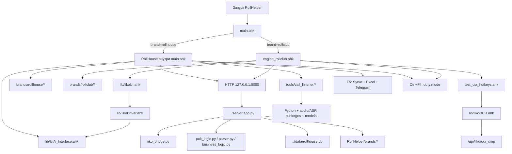

# Архитектурная декомпозиция RollHelper

Статус документа: карта текущих зависимостей и план безопасного разделения. Рабочий код пока не переносится и не удаляется.

## 1. Зачем нужна декомпозиция

Сейчас `main.ahk` и `engine_rollclub.ahk` одновременно выполняют несколько разных задач:

- запускают приложение и локальный сервер;
- показывают операторский пульт;
- читают и изменяют заказ в Syrve;
- содержат бизнес-правила конкретного бренда;
- пробивают СІВ, палочки и подарки;
- запускают дежурство по заказам;
- формируют отчёт F5;
- управляют обзвоном;
- содержат настройки, диагностику и инструменты разработчика.

Из-за этого таймер или горячая клавиша одного сценария может вмешаться в другой. Пример: дежурство продолжает работать во время ручного заказа, а F1 удерживает общий AHK-поток и задерживает `Ctrl+Enter`.

Цель первого этапа — не переписать приложение, а провести чёткие границы:

1. обязательное общее ядро;
2. обязательная логика бренда;
3. подключаемые рабочие модули;
4. диагностические и разработческие инструменты;
5. пользовательские и временные данные.

## 2. Текущие точки запуска

### RollHouse

- Главный файл: `main.ahk`.
- Использует AutoHotkey v1.1.
- Подключает `lib/UIA_Interface.ahk`.
- Рабочая конфигурация бренда: `brands/rollhouse/RkConfig.ini`.
- Если в `settings.ini` выбран RollClub, запускает `engine_rollclub.ahk` и завершает текущий процесс.
- Запускает или контролирует локальный HTTP-сервер на `127.0.0.1:5000`.

### RollClub

- Главный файл: `engine_rollclub.ahk`.
- Использует AutoHotkey v1.1.
- Подключает `lib/IikoUI.ahk`, который подключает `lib/IikoDriver.ahk`, а тот — `lib/UIA_Interface.ahk`.
- Рабочая конфигурация бренда: `brands/rollclub/RkConfig.ini`.
- Запускает или контролирует тот же локальный HTTP-сервер на `127.0.0.1:5000`.
- В рабочий файл напрямую подключён `test_uia_hotkeys.ahk`, то есть тестовые UIA/OCR-хоткеи сейчас физически являются частью production-процесса RollClub.

### Локальный сервер

- Находится не внутри репозитория RollHelper, а в соседней папке `../server`.
- Основной файл: `../server/app.py`.
- Запуск: `../server/start.bat` или прямой запуск `app.py` из AHK.
- Порт: `5000`.
- Требования сервера перечислены в `../server/requirements.txt`: Flask, Flask-Cors и `uiautomation`.
- База RollHouse находится ещё в одном внешнем расположении: `../data/rollhouse.db`.

Это главный риск будущего дистрибутива: Git-репозиторий RollHelper сам по себе сейчас не содержит весь обязательный runtime.

## 3. Текущий граф зависимостей



## 4. Что является обязательным ядром

Ядро не должно знать, чем RollHouse отличается от RollClub. Оно даёт бренду инфраструктуру и гарантирует, что сценарии не мешают друг другу.

### `core/bootstrap`

- единственный запуск приложения;
- запрет второго экземпляра;
- выбор бренда;
- вычисление путей без привязки к имени Windows-пользователя;
- загрузка реестра модулей;
- запуск обязательных процессов в правильном порядке;
- корректное завершение дочерних процессов.

### `core/config`

- чтение общих настроек;
- чтение конфигурации выбранного бренда;
- разделение заводских значений и пользовательских настроек;
- единый способ получать пути к package, runtime, logs и user data.

### `core/iiko`

- низкоуровневый UIA/WinAPI-доступ;
- поиск окна Syrve;
- безопасное чтение и изменение контролов;
- общий набор действий: фокус заказа, ввод текста, выбор оплаты, подтверждение, сохранение;
- единые таймауты и понятные ошибки.

На первом этапе существующие `RhUia*`, `IikoUI.ahk` и `IikoDriver.ahk` не надо переписывать. Над ними создаётся общий фасад с сохранением текущих сигнатур, после чего реализации можно объединять по одной функции.

### `core/orchestration`

Нужен один координатор операций вместо набора независимых флагов `RhEnterBusy`, `RhFinishBusy`, `rhPunchBusy`, `_inDutyTake`, `kcBusy` и других.

Предлагаемые состояния:

- `Idle`;
- `ReadingOrder`;
- `EditingOrder`;
- `PunchingSiv`;
- `FinishingOrder`;
- `DutyScanning`;
- `DutyTaking`;
- `Reporting`;
- `Calling`;
- `Diagnostics`.

Правило: в один момент только одна операция имеет право управлять Syrve. Ручная операция оператора всегда важнее фонового модуля. При тильде, F1 или `Ctrl+Enter` дежурство должно немедленно прекратить таймер и освободить управление.

### `core/ui`

- оболочка пульта;
- общие статусы и сообщения об ошибках;
- общая оболочка настроек;
- регистрация кнопок и горячих клавиш модулей;
- отсутствие бизнес-правил конкретного бренда.

### `core/server_client`

- проверка `/ping`;
- запуск сервера;
- ожидание готовности;
- HTTP-запросы с короткими таймаутами;
- единый журнал запросов;
- перезапуск без запуска второго экземпляра сервера.

### `core/logging`

- один понятный журнал действий оператора;
- отдельный технический журнал;
- идентификатор операции, чтобы видеть всю цепочку одного Enter или одного автоприёма;
- автоматическая очистка старых логов.

## 5. Обязательный пакет RollHouse

Пакет RollHouse должен содержать только то, без чего невозможно открыть, подготовить и завершить обычный заказ RollHouse.

### Обязательные части

- `OrderReader`: получение исходных данных заказа;
- `OrderParser`: оплата, бонусы, время, адрес, кухня, комментарии и приборы;
- `OrderState`: единая модель того, что показано в пульте и что будет внесено;
- `OrderApply`: перенос полей в Syrve;
- `Payments`: правила оплаты, сдачи, онлайн-оплаты и бонусов;
- `Gifts`: расчёт и пробитие подарка;
- `Siv`: роллы, обычные и учебные палочки, соевый соус, имбирь и васаби;
- `Zones`: KML, стоимость доставки и ручное изменение зоны;
- `FinishOrder`: подтверждение и сохранение на точку;
- `RollHousePult`: отображение брендовых полей и действий.

### Данные RollHouse

Неизменяемые данные пакета:

- шаблоны и значения по умолчанию;
- базовая KML-карта;
- схемы конфигурации;
- PLU по умолчанию.

Пользовательские данные, которые обновление не должно затирать:

- `RkConfig.ini` после настройки на конкретном ПК;
- выбранный пользователем KML;
- локальные цены доставки;
- UIA-карта элементов;
- `last_enter_state.ini`;
- `enter_state_history.log`;
- локальные логи и диагностические снимки.

## 6. Обязательный пакет RollClub

### Обязательные части

- чтение и разбор заказа;
- применение полей в Syrve;
- оплата и подарки;
- СІВ и приборы;
- зоны и адреса;
- локальная база кухонь;
- локальные промокоды;
- завершение заказа;
- пульт RollClub.

### Отдельные опциональные части RollClub

- синхронизация кухонь из Google Sheets;
- диагностический сбор UIA-дерева;
- OCR состава заказа;
- тестовые Ctrl+F2…Ctrl+F10.

Текущий прямой `#Include test_uia_hotkeys.ahk` должен быть убран из production только после появления отдельного диагностического модуля и проверки, что ни одна рабочая функция не вызывает его метки.

## 7. Подключаемые модули

Модуль подключается через описание, а не через специальный код лаунчера или бренда.

Минимальный контракт модуля:

```json
{
  "id": "duty",
  "version": "1.0.0",
  "brands": ["rollhouse", "rollclub"],
  "entrypoint": "module.ahk",
  "enabledByDefault": false,
  "requires": ["core.iiko", "core.server_client"],
  "hotkeys": ["Ctrl+F4"]
}
```

### `modules/duty`

Назначение: одноразовое дежурство до первого успешно открытого свободного заказа.

Зависимости:

- `core.orchestration`;
- `core.iiko`;
- `core.server_client`;
- брендовый обработчик кандидата.

Контракт бренда:

- `CanScan()`;
- `FindCandidate()`;
- `OpenCandidate(candidate)`;
- `ReadOpenedOrder()`;
- `OnDutyStopped(reason)`.

Модуль не имеет права включаться сам. Повторное нажатие `Ctrl+F4` выключает его немедленно. После открытия заказа модуль возвращается в `Idle` и не запускается снова без оператора.

### `modules/reports.shift`

Текущий F5 зависит от Syrve, координат отчёта, Microsoft Excel и Telegram Desktop. Это отдельный рабочий модуль, а не часть обработки заказа.

На первом переносе сохраняются существующие шаги и F5. Меняется только местоположение кода и подключение через registry. Переписывать отчёт одновременно с переносом нельзя.

### `modules/calling`

В один модуль нужно собрать:

- старый F2 с ImageSearch;
- список обзвона F6/F7;
- MicroSIP Assistant;
- определение аудиоканала;
- запись, VAD и распознавание;
- модели ASR;
- историю звонков.

Этот модуль не должен запускать Python, слушать аудио или регистрировать свои горячие клавиши, пока он выключен.

Его внешние зависимости сейчас включают Python и пакеты `numpy`, `pyaudiowpatch`/`pyaudio`, `sounddevice`, `soundfile`, `torch`, `faster-whisper`, `sherpa-onnx`, `vosk`, `pywin32`, `keyboard` и `scipy`. Точный production-набор нужно зафиксировать отдельным lock-файлом после удаления экспериментальных скриптов из runtime-пакета.

### `modules/ocr`

- AHK-захват области заказа;
- `lib/IikoOCR.ahk`;
- серверный `/api/iiko/ocr_crop`;
- OCR-движок и его модели/бинарники;
- окно диагностики результата.

OCR не должен загружаться при обычной работе, если модуль выключен.

### `modules/crm`

- `/api/customer`;
- `/api/call`;
- `/api/order`;
- карточка клиента и связанные действия.

CRM не должен быть зависимостью Enter, F1, СІВ или завершения заказа.

### `modules/web_pult`

- открытие браузерного пульта;
- его API;
- статика сервера.

Десктопный пульт должен продолжать работать, если этот модуль выключен.

### `modules/diagnostics`

- UIA-сканер;
- снимок дерева Syrve;
- тестовые горячие клавиши;
- smoke-тесты;
- OCR-диагностика;
- проверка сервера и путей.

UIA-сканер можно оставить доступным из настроек, но он не должен регистрировать глобальные тестовые хоткеи в обычном режиме.

## 8. Runtime, config и архив

### Runtime и пользовательские данные

В будущем должны находиться вне папки установленной версии, например:

```text
%LOCALAPPDATA%\RollHelper\
  config\
    common.ini
    brands\rollhouse\
    brands\rollclub\
    modules\calling\
  data\
    rollhouse.db
    call_listener\
  logs\
  cache\
```

### Неизменяемые файлы приложения

```text
%LOCALAPPDATA%\RollHelper\packages\
  core\<version>\
  brands\rollhouse\<version>\
  brands\rollclub\<version>\
  modules\duty\<version>\
  modules\reports.shift\<version>\
  modules\calling\<version>\
```

### Архивные и разработческие файлы

После прохождения smoke-тестов можно переместить в единый `_archive`:

- `*.BEFORE_*`;
- `*.bak_*`;
- старые portable-сборки;
- разовые дампы UIA;
- старые OCR-скриншоты;
- временные скрипты диагностики;
- benchmark-результаты;
- старые логи и crash-файлы.

Перемещать их до фиксации зависимостей нельзя: некоторые production-файлы пока прямо подключают файлы с названием `test_*`.

## 9. Абсолютные пути и внешние привязки

Перед дистрибутивом обязательно устранить:

- путь к Python пользователя `C:\Users\voffk\AppData\Local\Programs\Python\Python313\python.exe`;
- обязательный сервер в `../server`;
- базу в `../data/rollhouse.db`;
- ожидание конкретных окон Excel, Telegram, MicroSIP и SoundPad без проверки наличия;
- фиксированный порт `5000` без единого владельца процесса;
- локальный порт автообзвона `8765` без централизованного lifecycle;
- настройки аудиоустройства, привязанные к номеру устройства вместо устойчивого имени/идентификатора.

## 10. Целевая структура исходников

```text
RollHelper/
  app/
    RollHelper.ahk
  core/
    bootstrap/
    config/
    iiko/
    orchestration/
    server_client/
    ui/
    logging/
  brands/
    rollhouse/
      brand.json
      entrypoint.ahk
      order/
      payments/
      gifts/
      siv/
      zones/
      defaults/
    rollclub/
      brand.json
      entrypoint.ahk
      order/
      payments/
      gifts/
      siv/
      kitchens/
      promos/
      zones/
      defaults/
  modules/
    duty/
    reports.shift/
    calling/
    ocr/
    crm/
    web_pult/
    diagnostics/
  server/
    core/
    brands/
    modules/
  Launcher/
  docs/
  tests/
```

Это целевая схема, а не команда немедленно переместить файлы. На ранних этапах новые фасады могут вызывать старые метки и функции в `main.ahk` и `engine_rollclub.ahk`.

## 11. Безопасный порядок миграции

### Этап 0. Зафиксировать эталон

1. Сделать отдельный checkpoint-коммит перед архитектурными правками.
2. Проверить синтаксис `main.ahk` и `engine_rollclub.ahk` именно AutoHotkey v1.1.
3. Записать smoke-матрицу RollHouse и RollClub.
4. Сохранить рабочие конфиги отдельно от кода.

Минимальная smoke-матрица RollHouse:

- тильда читает заказ и открывает пульт;
- Enter вносит поля, оплату, подарок и СІВ;
- F1 пробивает СІВ отдельно;
- `Ctrl+Enter` подтверждает и сохраняет;
- `Ctrl+F4` включается и выключается вручную;
- F5 создаёт отчёт;
- настройки сохраняют и удаляют UIA-элементы.

Минимальная smoke-матрица RollClub:

- тильда читает заказ;
- кухни, промокоды и зоны определяются;
- Enter выполняет брендовый сценарий;
- F1 и завершение заказа работают;
- `Ctrl+F4` включается и выключается вручную;
- диагностические хоткеи выключены в production-режиме.

### Этап 1. Добавить координацию, ничего не переносить

1. Создать `OperationCoordinator`.
2. Обернуть существующие входы тильды, F1, Enter, `Ctrl+Enter`, F5, F6 и `Ctrl+F4`.
3. Запретить фоновым таймерам работу вне разрешённого состояния.
4. Добавить единый operation id в лог.

Это самый важный этап для стабильности. Он должен быть выполнен раньше физического разделения файлов.

### Этап 2. Ввести registry модулей

1. Создать декларативный список модулей и флагов включения.
2. Сохранить прежние горячие клавиши через тонкие wrappers.
3. Убедиться, что выключенный модуль не создаёт таймеры и процессы.
4. Проверить обычный заказ со всеми дополнительными модулями выключенными.

### Этап 3. Вынести диагностику и OCR

1. Убрать прямое включение developer test suite из RollClub через feature flag.
2. Перенести тестовые хоткеи в `modules/diagnostics`.
3. Перенести OCR в `modules/ocr` без изменения API.
4. Снова выполнить smoke-матрицу RollClub.

### Этап 4. Вынести отчёт F5

1. Перенести код без изменения последовательности действий.
2. Оставить F5 wrapper в прежнем месте.
3. Проверить Excel и Telegram на реальном отчёте.
4. Только после этого улучшать координатные действия.

### Этап 5. Вынести автообзвон

1. Разделить старый F2 и новый F6-сценарий внутри одного пакета.
2. Перенести Python, модели и runtime-конфиг в границы модуля.
3. Убрать абсолютные пути к Python.
4. Запретить запуск listener/server, если модуль выключен.
5. Проверить обычную обработку заказов без установленного модуля обзвона.

### Этап 6. Вынести дежурство

1. Создать общий duty engine.
2. Подключить RollClub через брендовый adapter без изменения поведения.
3. Подключить RollHouse вторым adapter.
4. Проверить мгновенное выключение и отсутствие самозапуска.
5. Проверить конфликт с тильдой, F1, Enter и `Ctrl+Enter`.

### Этап 7. Разделить брендовые монолиты

1. Переносить по одному блоку: parser, payments, zones, gifts, SІВ, apply.
2. После каждого блока выполнять синтаксическую и ручную проверку.
3. Оставлять совместимые wrappers до завершения миграции.
4. Не переименовывать одновременно функции и файлы.

### Этап 8. Включить сервер в пакет

1. Перенести сервер внутрь репозитория или оформить отдельным package.
2. Разделить server core, brand providers и optional routes.
3. Перенести базу и runtime-данные в `%LOCALAPPDATA%`.
4. Подготовить автономный Python runtime для оператора.
5. После этого собирать GitHub Release для лаунчера.

## 12. Критерии готовности архитектурного этапа

Архитектурная декомпозиция считается успешно подготовленной, когда:

- обычный заказ RollHouse работает без модулей обзвона, OCR, отчётов и дежурства;
- обычный заказ RollClub работает без диагностического test suite;
- выключенный модуль не регистрирует таймеры, хоткеи и процессы;
- один координатор гарантирует, что Syrve управляет только один сценарий;
- сервер и база больше не зависят от соседних папок;
- пользовательские настройки и runtime отделены от файлов версии;
- launcher видит core, brands и modules как одинаковые packages;
- новый бренд добавляется манифестом и своим entrypoint без изменений launcher/core.

## 13. Решение на текущий момент

Сейчас нельзя безопасно «просто вырезать F2», `Ctrl+F4`, OCR или F5. Сначала нужно внедрить две небольшие инфраструктурные границы без изменения поведения:

1. единый `OperationCoordinator`;
2. registry модулей с включением и выключением.

После этого первым физически отделяется `modules/diagnostics` вместе с тестовыми хоткеями RollClub. Это минимальный перенос с максимальной пользой: production перестанет зависеть от developer test suite, а OCR останется доступен как отдельный модуль.

## 14. Утверждённый состав первого RollHouse MVP

Включены:

- обычное чтение заказа по тильде;
- операторский пульт;
- Enter и перенос данных в Syrve;
- F1 и СІВ;
- `Ctrl+Enter` для подтверждения и сохранения;
- настройки, необходимые базовой обработке заказа.

Не входят в первый MVP и выключены профилем модулей:

- F5 и отчёт через Excel/Telegram;
- F2 и старый автоприём звонка;
- F6/F7/Ctrl+F6 и весь модуль обзвона;
- `Ctrl+F4` и дежурство по заказам;
- OCR;
- CRM;
- веб-пульт, его Ctrl+тильда и пункт меню трея;
- developer diagnostics.

Код этих возможностей пока не удаляется. Профиль `config/mvp_modules.ini` запрещает регистрацию их горячих клавиш и запуск фоновых таймеров. Позже каждый блок будет физически вынесен в отдельный package.
